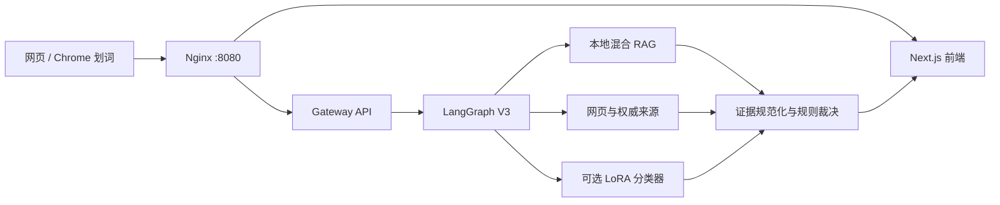

# RumorBuster V2.1

面向网页端与浏览器划词插件的可追溯事实核验工作台。

RumorBuster 会拆分待核验主张，并行检索本地知识与公开网页，校验来源、原文、时间和独立性，再由确定性规则生成结论。证据不够时明确返回“证据不足”，不会让模型自行猜测真假。

课程项目已于 2026-08-25 结项。当前默认分支为 `main`，详细验证结果和未完成边界见[项目状态](docs/PROJECT_STATUS.md)。

| 证据实验室首页 | 结构化历史实测报告 |
|---|---|
|  |  |

## 版本

| 产品版本 | 内部工作流 | 状态 |
|---|---|---|
| RumorBuster V2.0 | `rumor_agent_v2` 串行阶段门控图 | 保留用于回归和故障回退 |
| **RumorBuster V2.1** | `rumor_agent` V3 显式 `StateGraph` | 当前默认版本 |

V2/V3 是内部工作流代号。为兼容 API、评测和历史报告，代码中的图 ID 与 `rumorbuster-report-v3` 报告格式不会随产品版本改名。

## 核心能力

- 支持文本、公开网页 URL 和 Chrome 划词入口；
- 使用 LangGraph `Send` 并行运行本地 RAG、普通网页研究、权威来源研究和可选分类器；
- 检查正文抓取状态、连续原文引文、发布时间、来源职权和来源独立性；
- 以“一条合格 A 或两条独立 B”为课程版确定性裁决门槛；
- 展示采用与排除的证据、规则结论、证据强度及可点击来源；
- 提供网页、统一核验 API、Markdown/JSON 导出和浏览器扩展。

## 五分钟启动

### 1. 准备环境

- Docker Desktop；
- DeepSeek API Key；
- Tavily API Key（默认网页搜索和抓取来源）。

### 2. 克隆默认版本

```bash
git clone https://github.com/zjs-ws/rumor-detector-demo.git
cd rumor-detector-demo
```

运行应用不需要训练数据子模块。只有复现实验或研究训练数据时才执行：

```bash
git submodule update --init --recursive
```

### 3. 创建本地配置

```bash
cp -n .env.example .env
cp -n config.example.yaml config.yaml
```

在 `.env` 中填写自己的密钥：

```dotenv
DEEPSEEK_API_KEY=sk-你的密钥
TAVILY_API_KEY=tvly-你的密钥
```

真实密钥只保存在本地，不要提交到 Git。

### 4. 启动生产编排

```bash
./scripts/quickstart.sh
```

脚本会校验配置，使用 `compose.prod.yaml` 构建全部服务，并等待统一入口通过健康检查。首次构建需要下载依赖，耗时会更长。

### 5. 打开并验证

- 工作区：<http://localhost:8080/workspace/chats/new>
- 健康检查：<http://localhost:8080/healthz>
- 历史案例：<http://localhost:8080/workspace/showcase>

```bash
curl http://localhost:8080/healthz
```

返回 `status: ready` 即表示 Gateway 和 LangGraph 已就绪。可以从“抽烟有害身体健康”等稳定事实开始测试；联网结果会随信息源可用性变化。

## 系统结构



| 服务 | 容器内端口 | 对外访问 |
|---|---:|---|
| Nginx | 80 | `http://localhost:8080` |
| Frontend | 3000 | 仅通过 Nginx |
| Gateway | 8001 | `/api/v1/*` |
| LangGraph | 2024 | `/api/langgraph/*` |

生产编排只发布 Nginx 端口。不要把 LangGraph 的开发端口直接暴露到公网。

## 常用操作

```bash
make check   # 环境与 Compose 配置检查
make up      # 构建并启动生产编排
make ps      # 查看服务状态
make logs    # 跟踪日志
make stop    # 停止生产编排
```

首次使用本地向量索引时可执行：

```bash
docker compose -f compose.prod.yaml --profile maintenance run --rm rag-indexer
```

修改端口时，在 `.env` 中设置 `RUMORBUSTER_HTTP_PORT`，再重新启动。

## 开发与测试

本地开发需要 Python 3.12、`uv`、Node.js 22 和 Corepack/pnpm。完整环境、分支策略和评测命令见[开发指南](docs/DEVELOPMENT.md)。

```bash
make install       # 安装 Python 依赖
make dev           # 启动 LangGraph 开发服务
make gateway       # 启动 Gateway
make test           # 后端测试
make lint           # Ruff 检查
make frontend-check # 前端测试、Lint 和类型检查
```

浏览器扩展测试：

```bash
node --test browser-extension/tests/*.mjs
```

提交改动前至少执行 `make check`、相关测试和 `git diff --check`。贡献约定见 [CONTRIBUTING.md](CONTRIBUTING.md)。

## API

- `POST /api/v1/checks`：创建核验；
- `GET /api/v1/checks/{check_id}`：查询核验状态和结果；
- `/api/langgraph/*`：前端使用的 LangGraph 流式协议。

部署、备份、恢复和 API 运维细节见[生产部署手册](docs/PRODUCTION_DEPLOYMENT.md)。

## 文档导航

- [文档总览](docs/README.md)
- [开发指南](docs/DEVELOPMENT.md)
- [项目状态与验证口径](docs/PROJECT_STATUS.md)
- [V3 工作流](docs/WORKFLOW_V3_IMPLEMENTATION.md)
- [三层架构与归属](docs/ARCHITECTURE_OWNERSHIP.md)
- [RAG 实现](docs/RAG_IMPLEMENTATION.md)
- [生产部署](docs/PRODUCTION_DEPLOYMENT.md)
- [真实联网验收](docs/REAL_FACTCHECK_ACCEPTANCE.md)
- [LoRA 模型部署](docs/MODELSCOPE_CLASSIFIER_DEPLOYMENT.md)

## 本地数据与安全

GitHub 只保存源码、配置模板、测试、评测清单和小型课程产物。以下内容不会进入 Git 或 Docker 镜像：

| 内容 | 本地路径 | 恢复方式 |
|---|---|---|
| 密钥与机器配置 | `.env*`、`config.yaml` | 从示例重新创建 |
| 会话、检查点与索引 | `runtime/`、`.deer-flow/` | 从备份恢复或重新生成 |
| Python/前端依赖 | `.venv/`、`frontend/node_modules/` | 根据锁文件重装 |
| 构建缓存 | `frontend/.next/`、Docker BuildKit cache | 重新构建 |
| 完整模型权重 | `final_result/` | 从专用模型存储下载或重新导出 |
| 本地课程参考材料 | `rag/`、`模型微调/*.docx` | 从课程资料备份恢复 |

微调分类器不是联网核验的最终裁决器，也不随 Compose 分发；未配置分类器时，系统会保留证据检索与规则裁决主流程。

## 已知限制

- 当前为课程归档和开发预览，不应直接暴露到公网；
- 默认没有注册登录和完整生产鉴权；
- 登录墙、付费墙、反爬网页和网络波动会导致证据不足；
- 本地 RAG 只提供历史解释上下文，不能替代当前网页证据；
- 3B 模型的 90% 是离线文本分类准确率，不代表整套联网核验系统准确率；
- 时间线只展示本轮抓取到的网页发布时间，不宣称识别绝对首发或传播路径。

完整边界与验证记录见[项目状态](docs/PROJECT_STATUS.md)。

## 开源基础

RumorBuster 基于 LangGraph 与 DeerFlow 进行领域化开发。项目新增事实核验工作流、混合 RAG、证据规范化、来源职权检查、确定性裁决、浏览器入口、结构化报告与评测材料。详细归属见[架构归属矩阵](docs/ARCHITECTURE_OWNERSHIP.md)。

本项目遵循仓库中的 [LICENSE](LICENSE)。
