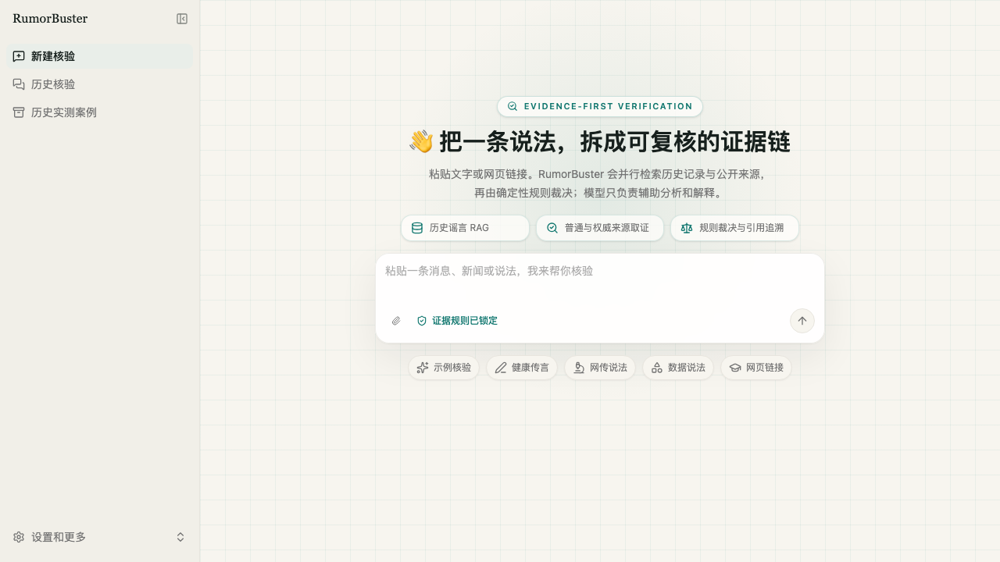
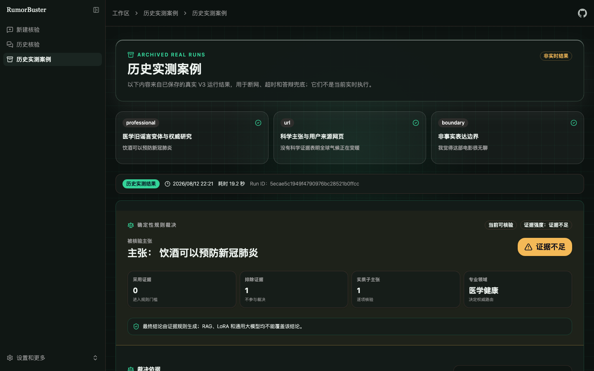

# RumorBuster

面向网页端与浏览器划词插件的可追溯事实核验工作台。

当前协作版本位于 `feature/import-mcp-frontend`，交接基线提交为
`96a875c`。课程开发、评测和答辩安排见
[课程项目计划](docs/COURSE_PROJECT_PLAN.md)，代码归属和接手顺序见
[工程交接文档](docs/CLAUDE_HANDOFF.md)。

用户可以在网页端粘贴新闻、社交媒体消息或其他文本进行核验，也可以通过浏览器扩展选中文字并直接进入核验工作区。当前分支已提供 RumorBuster 网页端、浏览器划词入口、智能体后端、API Gateway、模型调用与本地持久化能力。

| 证据实验室首页                                                         | 结构化历史实测报告                                                              |
| ---------------------------------------------------------------------- | ------------------------------------------------------------------------------- |
|  |  |

## 当前状态

截至 2026-08-13：

- RumorBuster 定向回归测试共 113 项通过；
- Ruff、ESLint、TypeScript 和 Next.js 生产构建通过；
- `compose.prod.yaml` 配置校验通过；
- 训练集和原测试集保持冻结，部署前后的 SHA-256 一致；
- 本地假 HTTP 服务已验证 V3 确实调用 ModelScope `/v1/chat`，且分类标签不能覆盖规则结论；
- ModelScope 真实权重的 GPU 推理、200 条模型评测和三案例双跑尚未执行，不能把本地适配测试表述为真实模型指标。

已验证：

- Docker Compose 本地部署
- RumorBuster Next.js 网页端
- DeepSeek 模型调用
- 谣言检测智能体基础对话
- API Gateway 健康检查
- 面向脚本与未来 MCP 的统一核验 API：`POST/GET /api/v1/checks`
- Nginx 单入口、生产前端镜像与持久化目录的单机云部署配置
- HTML、XHTML 与 SVG 等可执行网页产物强制下载，且 MIME 判断不依赖宿主机差异
- SQLite 会话与检查点持久化
- 无需额外密钥、保留原始搜索结果的 DuckDuckGo 公开网页检索
- 输入公开网页 URL 后抓取正文，并在报告中生成可点击、可追溯的来源引用
- URL-only 输入会先读取原网页再提取主张；结构化提取不兼容时回退到严格 JSON，仍无法提取则要求补充主张，不搜索“网页主要内容”等操作指令
- 运行时校验最终引用：移除本轮工具未返回的链接；未引用独立外部来源时，自动降级为“存疑（证据不足）/低证据强度”
- 可核验性预分流，避免对观点、隐私和未来随机事件伪造真假结论
- 30 条已复核谣言记录和中文字符 n-gram TF-IDF Top-3 检索
- 结构化证据、A/B/C/D 来源分级、独立性/直接性/时效性校验与确定性裁决
- 受控官方来源职权表包含 WHO、政府/监管机构及气候领域 NASA/IPCC；官方域名仍必须与当前主张职权匹配才可升为 A 级
- V3 显式 LangGraph `StateGraph`：通过 `Send` 并行运行本地 RAG、普通网页研究、可选分类器和专业权威研究，以 reducer 汇合后再审查与裁决
- V2 串行阶段门控图以 `rumor_agent_v2` 保留，可用于回归比较和故障回退
- ModelScope `/v1/chat` 与 OpenAI Chat 双协议微调模型适配；最多三个子主张顺序分类，精确映射 `Yes/No/Unknown`，记录脱敏审计信息，标签仅作辅助信号
- 六类可追溯文本风险线索、核验目标与搜索提示；风险线索不会进入证据门槛
- 子主张级 LoRA 标签、规则结论和一致性对照，非法标签不会默认映射为“非谣言”
- `rumorbuster-report-v3`、并行分支状态、来源等级校正、子主张裁决和安全降级报告，并兼容读取 v1/v2
- 受限 `evidence-critic` 检查子主张覆盖与确定性裁决门槛，不能新增证据、URL、等级或 verdict；覆盖但门槛不足时也可申请唯一一次补检
- `web_fetch` 在结构化工具结果中记录抓取时间，V3 只按成功抓取的 URL 由代码回填 `fetched_at`；搜索摘要或模型自报时间不能冒充正文抓取
- 至少三个可追溯事件时生成传播演化时间线，否则明确显示时间线证据不足
- 结构化证据卡片、排除原因、Markdown/JSON 下载和打印
- Chrome 浏览器划词核验入口
- “证据实验室”亮暗双主题界面：首屏突出规则结论、证据强度与可追溯来源，技术审计默认折叠
- V3 七阶段执行进度和 RAG、普通网页、权威来源、LoRA 四个并行分支状态
- 三个带真实运行日期的历史实测案例；存档结果与实时核验明确区分并复用同一报告组件
- 浏览器扩展可在设置页修改 RumorBuster 地址，默认使用生产编排入口 `http://localhost:8080`
- 正式 Markdown/JSON 导出不包含模型 reasoning、工具参数、系统提示词、密钥或服务地址
- Apple Silicon Docker 环境

继续开发中：

- P0：短租 GPU，完成微调模型真机部署、9 条双跑冒烟和冻结评测集；
- P0：三个真实网页案例各运行两次并保存脱敏报告；
- P1：更稳定的可选搜索提供商和网页正文抓取；
- P1：完善报告、PPT、视频和答辩材料；
- P2：注册登录、生产鉴权、MCP 和更大规模知识库。

> 当前版本为开发预览版，不建议直接暴露到公网。

## 快速启动

1. 克隆并进入项目：

   ```bash
   git clone \
     --branch feature/import-mcp-frontend \
     --recurse-submodules \
     https://github.com/zjs-ws/rumor-detector-demo.git

   cd rumor-detector-demo
   ```

   已经克隆过仓库的队友执行：

   ```bash
   git fetch origin
   git switch feature/import-mcp-frontend
   git pull --ff-only
   git submodule update --init --recursive
   ```

   `模型微调/数据集` 是冻结的独立数据仓库，以 Git 子模块方式引用。不要在主项目中重新生成、移动或提交该数据集。

2. 创建本地配置：

   `cp -n .env.example .env`

   `cp -n config.example.yaml config.yaml`

3. 编辑 `.env`，填写自己的 `DEEPSEEK_API_KEY`。

   网页正文抓取默认使用受大小、超时、重定向和公网地址约束的本地读取；如需
   更稳定的复杂网页解析，可选填 `JINA_API_KEY` 启用 Jina Reader。接入已上传的
   微调模型时，按[微调模型部署与验收手册](docs/MODELSCOPE_CLASSIFIER_DEPLOYMENT.md)
   建立 SSH 隧道；模型服务端口不应暴露公网。

4. 一键启动：

   `./scripts/quickstart.sh`

5. 确认服务和定向测试：

   ```bash
   docker compose ps
   docker compose -f compose.prod.yaml config -q

   docker compose -f compose.prod.yaml run --rm -T \
     -v "$PWD/packages:/app/packages:ro" \
     -v "$PWD/tests:/app/tests:ro" \
     -v "$PWD/scripts:/app/scripts:ro" \
     -v "$PWD/evaluation:/app/evaluation:ro" \
     langgraph uv run pytest \
       tests/test_rumor_*.py \
       tests/test_finetuned_classifier_evaluation.py \
       tests/test_checks_api.py \
       tests/test_demo_runner.py \
       tests/test_jina_web_fetch.py \
       tests/test_subagent_executor.py -q
   ```

## 队友接手顺序

1. 先阅读 [V3 工作流说明](docs/WORKFLOW_V3_IMPLEMENTATION.md)和[三层架构归属](docs/ARCHITECTURE_OWNERSHIP.md)。
2. 运行上面的 113 项定向回归，确认环境没有破坏当前基线。
3. 不修改训练集、原测试集和既有 Benchmark，不重新训练模型。
4. 有 GPU 资源后，按[微调模型部署手册](docs/MODELSCOPE_CLASSIFIER_DEPLOYMENT.md)建立 SSH 隧道并运行真实验收。
5. 只把阻断测试、真机结果和脱敏演示产物提交到当前协作分支；不要提交密钥、运行数据库或模型权重。

本仓库没有分发三篇本地 Word 论文原文，它们已被 `模型微调/*.docx` 规则忽略。仓库只保留不含论文全文的[论文经验落地矩阵](docs/PAPER_TO_IMPLEMENTATION.md)。

## 使用 DeepSeek 驱动 Claude Code

本项目提供 `scripts/claude-deepseek.sh`，通过 DeepSeek 的 Anthropic
兼容端点启动 Claude Code。脚本默认复用根目录 `.env` 中已有的
`DEEPSEEK_API_KEY`，不会将密钥写入受 Git 跟踪的配置文件。

```bash
cd ~/Projects/rumor-detector-demo
./scripts/claude-deepseek.sh
```

进入会话后执行 `/continue-rumorbuster`，Claude Code 会读取当前课程计划、
工程交接和未完成里程碑继续开发；提交前可执行
`/validate-rumorbuster`。

默认模型分工：

- 主会话、复杂编码：`deepseek-v4-pro[1m]`
- 子任务和轻量调用：`deepseek-v4-flash`
- 推理强度：`max`

如需单独配置 Claude Code 的 Key 或覆盖模型：

```bash
cp .claude/deepseek.env.example .claude/deepseek.env
nano .claude/deepseek.env
./scripts/claude-deepseek.sh
```

`.claude/deepseek.env` 已被 Git 忽略。不要把真实 Key 写入
`.claude/settings.json`、README 或提交记录。该启动方式按 DeepSeek API
用量计费，不会消耗 Claude Pro/Max 订阅额度。

## 安装浏览器划词扩展

1. 启动生产编排，确认 `http://localhost:8080` 可以访问。
2. 在 Chrome 打开 `chrome://extensions`。
3. 开启“开发者模式”，点击“加载已解压的扩展程序”。
4. 选择仓库中的 `browser-extension/` 目录。
5. 在任意网页选中文字，右键选择“用 RumorBuster 核验”。

如果入口不是本机 `8080`，在扩展详情页打开“扩展程序选项”，填写新的
HTTP(S) 基础地址。地址保存在 `chrome.storage.sync`，更换服务器时无需重新打包。

扩展会打开新对话并预填原文与来源页面，不会自动发送。选中文字通过 URL
fragment 传递，不会进入本地服务的 HTTP 请求或访问日志；前端读取后会立即
清除地址栏中的 fragment。

## 服务地址

- 生产统一入口：`http://localhost:8080`
- 历史实测案例：`http://localhost:8080/workspace/showcase`
- 聚合健康检查：`http://localhost:8080/healthz`
- 统一核验 API：`http://localhost:8080/api/v1/checks`
- LangGraph 流式协议：`http://localhost:8080/api/langgraph/*`

开发编排可按 Compose 配置直接访问前端、Gateway 与 LangGraph 端口；最终用户和
浏览器扩展应使用 Nginx 的 `8080` 单入口。

`2024` 端口仅用于后端开发调试，不应直接暴露给最终用户。

## 生产模式与统一 API

生产模式只发布 Nginx 端口，网页、Gateway 和 LangGraph 通过 Docker 内网互访：

```bash
cp .env.production.example .env.production
docker compose -f compose.prod.yaml config
docker compose -f compose.prod.yaml up -d --build
python3 scripts/check_production_ready.py
```

网页与 LangGraph 流式接口使用同源相对地址，不把本机服务地址编译进生产包。第三方程序调用 `POST /api/v1/checks` 创建核验，再用 `GET /api/v1/checks/{check_id}` 查询；未来 MCP 只需薄封装这两个接口。完整的启动、备份、恢复与故障处理见 [生产部署手册](docs/PRODUCTION_DEPLOYMENT.md)。

## 常用命令

- 查看状态：`docker compose ps`
- 查看日志：`docker compose logs -f`
- 重新构建：`docker compose up -d --build --force-recreate`
- 停止服务：`docker compose down`
- 环境检查：`./scripts/doctor.sh`
- DeepSeek 模式启动 Claude Code：`./scripts/claude-deepseek.sh`
- URL 核验端到端冒烟测试：`docker compose run --rm -T -v "$PWD/scripts:/app/scripts:ro" -e LANGGRAPH_BASE_URL=http://langgraph:2024 langgraph uv run python scripts/smoke_url_factcheck.py`
- 固定三案例 V2/V3 留痕：`docker compose -f compose.prod.yaml run --rm -T -v "$PWD/evaluation:/app/evaluation" langgraph uv run python scripts/run_demo_cases.py --base-url http://langgraph:2024`
- 真实模型 9 条双跑冒烟：`python3 scripts/run_classifier_smoke.py --base-url http://127.0.0.1:18000 --repeats 2`
- 冻结早期预警集评测：`python3 scripts/evaluate_finetuned_classifier.py --base-url http://127.0.0.1:18000 --dataset early`
- 冻结对抗集评测：`python3 scripts/evaluate_finetuned_classifier.py --base-url http://127.0.0.1:18000 --dataset adversarial`
- 前端纯函数测试：`corepack pnpm --dir frontend test`
- 浏览器扩展测试：`node --test browser-extension/tests/*.mjs`
- 前端质量检查：`corepack pnpm --dir frontend format && corepack pnpm --dir frontend lint && corepack pnpm --dir frontend typecheck && corepack pnpm --dir frontend build`

## 配置安全

可以提交：

- `.env.example`
- `config.example.yaml`
- `compose.yaml`
- `Dockerfile.local`

禁止提交：

- `.env`
- `.env.production`
- `config.yaml`
- `.claude/deepseek.env`
- `runtime/`
- `local-backups/`
- `模型微调/*.docx`
- 模型权重

每位开发者使用自己的 API Key。真实密钥只保存在本地 `.env` 中。

## 项目结构

- `app/`：API Gateway 与消息通道
- `packages/harness/`：智能体运行核心
- `packages/harness/deerflow/agents/rumor_agent/`：谣言检测智能体
- `evaluation/`：可核验性、RAG、证据规则，以及按 V3 计划固定组成的 40 条综合离线评测清单
- `模型微调/数据集/`：冻结训练集和原测试集子模块；首次克隆必须使用 `--recurse-submodules`
- `模型微调/bench mark/`：既有课程 Benchmark，当前仅运行、不重新生成
- `frontend/`：RumorBuster Next.js 网页端
- `browser-extension/`：Chrome Manifest V3 划词核验扩展
- `compose.yaml`：本地 Docker 编排
- `compose.prod.yaml`：Nginx 单入口的生产编排
- `Dockerfile.local`：本地开发镜像
- `scripts/quickstart.sh`：一键启动
- `scripts/doctor.sh`：环境与安全检查
- `scripts/evaluate_rumorbuster.py`：确定性回归、对比与消融评测
- `scripts/evaluate_finetuned_classifier.py`：通过真实 `/v1/chat` 运行冻结的早期预警集与对抗集，不生成 Mock 指标
- `scripts/run_classifier_smoke.py`：在 GPU 隧道建立后运行 9 条、每条两次的真实模型冒烟验收
- `scripts/run_demo_cases.py`：独立线程运行固定案例，保存 V2/V3 报告、trace、分支耗时、抓取溯源和校验摘要
- `docs/ARCHITECTURE_OWNERSHIP.md`：LangGraph/DeerFlow/RumorBuster 归属矩阵
- `docs/DEFENSE_STUDY_GUIDE.md`：源码学习与答辩卡
- `docs/LABS.md`：日志、Sandbox、线程状态和消融实验手册
- `docs/WORKFLOW_V2_IMPLEMENTATION.md`：阶段门控、来源规则、时间线和答辩实验留痕
- `docs/WORKFLOW_V3_IMPLEMENTATION.md`：显式 StateGraph、并行汇合、受限子 Agent、回退策略与学习留痕
- `docs/PRODUCTION_DEPLOYMENT.md`：云主机部署、统一 API、备份恢复与故障处理
- `docs/MODELSCOPE_CLASSIFIER_DEPLOYMENT.md`：短租 GPU、SSH 隧道、真实模型调用与验收
- `docs/SOCIAL_CONTEXT_FUTURE.md`：未启用的评论质证扩展边界和 Fixture
- `docs/PAPER_TO_IMPLEMENTATION.md`：三篇论文思想、已实现内容和未实现边界

## 已知限制

1. 默认只配置 DeepSeek 主模型。
2. 微调分类模型服务不打包进 RumorBuster Compose；需在 GPU 主机独立启动并通过 SSH 隧道接入。没有真实 GPU 日志前不得把适配测试写成模型评测结果。
3. 普通研究员预算为 55 秒、1 次搜索和最多 4 次正文抓取；医学、法律、金融、政策与科学等专业主张额外并行启用权威研究员，预算为 55 秒、1 次搜索和最多 2 次抓取。补检最多一次、35 秒。搜索摘要只作线索，不能凑正式证据门槛。
4. 智能体已加入模型/工具调用上限，后续仍需补齐真实证据源后的复杂流程测试。
5. 当前智能体服务使用本地开发模式和无鉴权配置。
6. 注册登录尚未接入；浏览器扩展当前为本地加载版，默认连接 `http://localhost:8080`，可在扩展设置中更换为未来的云端地址。
7. 每轮最多抓取用户提供的 1 个公开 HTTP(S) URL，正文最多保留 12,000 个字符。登录墙、强动态渲染或阻止爬取的网页可能无法读取；私网、localhost 与非 HTTP(S) 地址会被拒绝。
8. 本地 RAG 是透明可解释的 TF-IDF 基线，不是语义向量大模型；命中历史记录不会直接决定当前主张。
9. Sandbox 中间件已装配，但不是事实裁决核心；LocalSandbox 不是容器级安全边界，公网环境应使用更强隔离 Provider。
10. 评论质证只保留接口草案，当前没有评论爬取、评论分析或传播树能力。

## 产品方向

独立网页端和浏览器划词扩展共用同一套新对话流程。浏览器入口只负责安全地预填待核验内容，实际提交仍由用户确认。V3 由显式节点和条件边控制顺序，在可核验性判断后并行取证；所有分支先经 Schema、来源、时效、独立性与 URL 校正，再由确定性规则裁决。子 Agent 不投票，通用大模型只负责结构化提取和解释，终局节点重新绑定规则结论与观察到的 URL。前端优先展示 `rumorbuster-report-v3`，同时保留旧报告与 Markdown 兼容输出。

## 开源基础与团队工作

RumorBuster 采用 LangGraph 作为状态与 Agent 运行基础，并基于 DeerFlow 开源框架进行领域化二次开发。框架提供状态图、工具、子 Agent、中间件、Sandbox 和配置基础；团队实现事实核验工作流、轻量 RAG、微调服务适配、证据规则、终局校验、浏览器入口、结构化界面与评测材料。详见 [三层架构与归属矩阵](docs/ARCHITECTURE_OWNERSHIP.md)。
