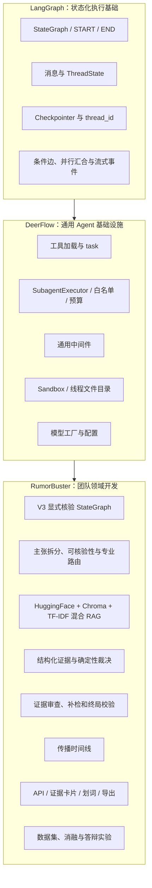
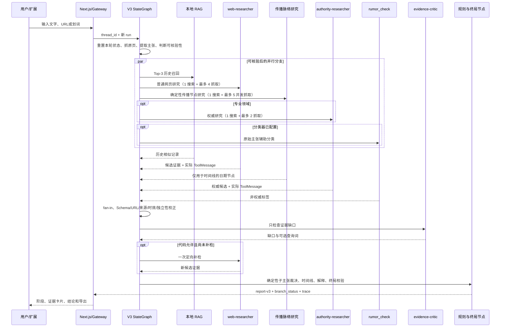

# RumorBuster 三层架构与归属矩阵

## 项目口径

> RumorBuster 使用 LangGraph 的状态图与检查点能力，基于 DeerFlow 的模型、工具和受限子 Agent 基础设施进行领域化二次开发。团队实现了谣言核验 StateGraph、本地向量与关键词混合 RAG、专业路由、证据规则、传播时间线、结构化报告、API、前端和评测。

不能回答“整个 Agent 框架都是我们从零实现的”，也不能只说“套了 DeerFlow”。准确说法是：框架层复用，谣言核验的节点、状态、并行策略、证据门槛、界面与评测由项目完成。

## 归属矩阵

| 能力 | 上游提供 | RumorBuster 实际使用 | 团队新增或修改 | 删除后的影响 |
|---|---|---|---|---|
| 图运行 | LangGraph `StateGraph`；LangChain `create_agent` | V3 用显式图；V2 回退与研究子图用 `create_agent` | V3 节点、条件边、fan-in 和失败分支 | 需自行实现状态执行与消息循环 |
| 会话与检查点 | LangGraph Checkpointer | `thread_id` 保存消息和结构化状态 | `run_id` 区分同线程的本轮证据 | 无法恢复会话；若无 `run_id` 容易串用旧证据 |
| 工具系统 | DeerFlow/LangChain | 搜索、抓取、分类器、RAG 与规则函数 | 领域 Schema、参数锁定、异常契约 | 工具不能配置化执行 |
| 子 Agent | DeerFlow `SubagentExecutor` | 网页研究、权威研究、证据审查 | 三个受限角色、工具预算、ToolMessage 来源留痕 | 主图需直接获得搜索权限，隔离和审计变弱 |
| Sandbox | DeerFlow | V3 核心路径不调用 | 未作为真假算法；只保留文件隔离能力 | 不影响规则裁决，失去安全归档基础 |
| 通用中间件 | DeerFlow | V2 使用错误、限额、防循环与 EvidencePolicy | V2 阶段门控与终局规则 | V2 更易乱序、循环或编造引用 |
| 微调模型 | 外部可选服务 | 并行辅助分类 | 严格 JSON、12 秒超时、冲突展示 | 少一个风险信号，不改变 verdict |
| 本地混合 RAG | 团队实现 | 复核文档加载、中文分块、Top-K 历史知识 | HuggingFace Embedding、Chroma、字符 2—4 gram TF-IDF、RRF和证据隔离 | 稠密索引失败时退回TF-IDF；两者均失败仍可网页核验 |
| 专业路由 | 无 | 医学、法律、金融、政策、科学等启用权威研究 | 结构化领域 + 关键词兜底、受控域名 | 高风险主张可能漏查主管机构 |
| 证据审查 | DeerFlow 子 Agent 执行器 | critic 无工具，只查覆盖缺口 | 代码限制其不能新增事实，补检最多一次 | 关键子主张缺口更难被发现 |
| 来源与时间策略 | 无 | 校验研究候选 | 等级向下校正、365 天规则、同源合并、URL 白名单 | 普通网页可能被错误提升为权威证据 |
| 证据裁决 | 无 | 最终结论唯一来源 | A/B/C/D、职权、直接性、独立性、时效和子主张规则 | 退回大模型自由综合，不可复现 |
| 传播时间线 | 无 | 独立传播检索 + 已抓取事实证据 + 已复核 RAG 来源 | 受限搜索、日期/正文校验、同源去重、用途隔离、至少三节点 | 退化为普通证据列表，无法展示传播演化 |
| 最终校验 | V2 借用中间件生命周期 | V3 用 `finalize` 节点，V2 用 EvidencePolicy | 删除未观察 URL、绑定规则 verdict、模板降级 | 模型可能覆盖结论或编链接 |
| Web/API | Next.js、FastAPI、LangGraph SDK | 同源流式网页与 `/api/v1/checks` | v3 分支卡片、证据筛选、导出和兼容 | 只剩底层图，不能面向用户交付 |

## 当前真实调用链

这里没有“多个模型投票”。研究角色只提供候选证据或缺口检查，最终真假只能由 fan-in 后的确定性规则节点产生。

## 成员归属

上述"团队新增或修改"列到成员个人的映射、DeerFlow 框架改造清单与两人工作
归属矩阵（含 git 提交依据），见 [团队贡献与成员分工](TEAM_CONTRIBUTIONS.md)。
简要分工：成员一 zjswz111 负责智能体与后端（rumor_agent、中间件、子智能体、
信息源工具、统一核验 API、评测与部署）；成员二 baitea 负责子智能体执行
稳定化与证据-前端衔接。

## 实现入口

- V3 主图：`packages/harness/deerflow/agents/rumor_agent/graph_v3.py`
- V2/V3 工厂：`packages/harness/deerflow/agents/rumor_agent/__init__.py`
- 图注册：`langgraph.json`
- V2 阶段门控：`packages/harness/deerflow/agents/middlewares/rumor_workflow_gate_middleware.py`
- V2 终局中间件：`packages/harness/deerflow/agents/middlewares/rumor_evidence_policy_middleware.py`
- RAG：`packages/harness/deerflow/agents/rumor_agent/rag.py`
- 证据规则：`packages/harness/deerflow/agents/rumor_agent/evidence.py`
- 子 Agent 执行与留痕：`packages/harness/deerflow/subagents/executor.py`
- Gateway：`app/gateway/routers/checks.py`
- 结构化前端：`frontend/src/components/workspace/messages/rumor-report-card.tsx`

更完整的节点、预算、V2/V3 对照与学习安排见 `docs/WORKFLOW_V3_IMPLEMENTATION.md`。
