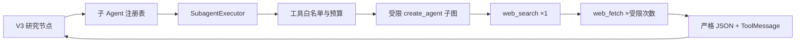
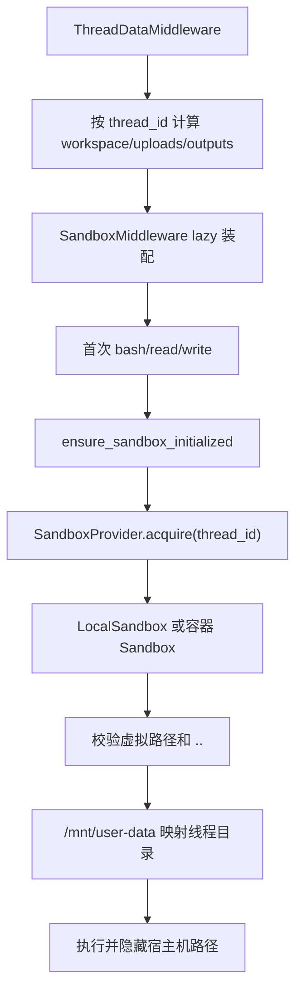

# DeerFlow / LangGraph 源码学习与答辩指南

学习每个模块都按同一模板记录：用途、核心接口、调用链、配置与生命周期、RumorBuster 用法、失败场景与团队改造。实验完成后在文末检查表登记日志路径、实验结果和讲解人。

## 1. LangGraph StateGraph 运行

- 用途：把业务阶段写成节点和条件边，以共享状态连接顺序、分支和汇合，省去自建调度与检查点协议。
- 核心接口：`StateGraph`、`START/END`、条件边、多入口 fan-in、状态 reducer、`ThreadState`、`RunnableConfig.configurable.thread_id`。
- V3 调用链：前端 `useStream` → LangGraph Server → `make_rumor_agent` → `build_rumor_graph_v3` → 重置/提取/路由 → 五个并行能力分支 → reducer 合并 `branch_status` → 证据审查/裁决/时间线/终局节点。
- V2 调用链：`make_rumor_agent_v2` → LangChain `create_agent` → AIMessage `tool_calls` → ToolNode → ToolMessage → 阶段门控中间件继续循环。
- 配置与生命周期：`langgraph.json` 同时注册 `rumor_agent` 和 `rumor_agent_v2`；同一 `thread_id` 恢复 checkpoint，每条新输入另建 `run_id` 并清空本轮证据。
- 本项目用法：扩展工作流状态、`branch_status`、`rumor_report` 和 trace；规则裁决节点必须位于 fan-in 之后。
- 失败与改造：并行分支分别记录异常并降级，不取消其他成功分支；终局模板不依赖解释模型成功。

答辩卡：LangGraph 提供“状态化执行机制”，不提供谣言证据规则。团队仍需定义工具、状态字段、证据门槛和失败分支。

## 2. DeerFlow Agent 装配

- 用途：根据配置选择模型、工具和中间件。
- 核心接口：`make_rumor_agent`、`make_rumor_agent_v2`、`RumorV3Services`、`create_chat_model`、`SubagentExecutor`。
- 调用链：`langgraph.json` → `make_rumor_agent(config)` → `build_rumor_graph_v3()`；V2 工厂才继续走 `_select_main_agent_tools()` → `_build_middlewares()` → `create_agent()`。
- 配置与生命周期：每次图工厂构造时读取模型、工具及环境变量；API Key 只来自环境变量。
- 本项目用法：V3 节点通过服务边界调用本地混合 RAG、抓取、分类器和受限研究执行器；主图不把 `web_search` 暴露给解释模型。RAG 使用 HuggingFace 中文 Embedding、Chroma 和 TF-IDF/RRF，微调服务未配置时该分支标记 `skipped`。
- 失败与改造：搜索/抓取/微调可独立关闭；RAG 和规则仍可离线工作，最终按证据不足降级。

最小实验：依次移除 `web_search`、`web_fetch` 和 `RUMOR_MODEL_BASE_URL`，启动 V3 并保存 `branch_status`；再构造 V2 工厂，对比其工具白名单。

## 3. 工具系统

- 用途：把确定性函数暴露为模型可调用的结构化能力。
- 核心接口：LangChain `@tool`、`BaseTool`、`ToolRuntime.state/context`。
- 调用链：模型生成工具名和参数 → ToolNode 按 Schema 校验 → 函数读取 runtime → 返回字符串/JSON → ToolMessage。
- 配置与生命周期：通用工具从 YAML 动态加载；RumorBuster 领域工具由 Agent 代码直接装配。
- 本项目用法：`web_fetch` 读原网页，`task` 搜证据，`rumor_check` 给辅助标签，`retrieve_verified_rumors` 召回历史，`assess_evidence` 绑定结论。
- 失败与改造：`ToolErrorHandlingMiddleware` 捕获普通异常并返回 `status=error` 的 ToolMessage；领域工具尽量返回稳定 JSON。

## 4. 子 Agent

- 用途：隔离搜索职责和权限，避免主 Agent 随意检索。
- 核心接口：`task`、`SubagentConfig`、`SubagentExecutor`、`_filter_tools`。
- 调用链：V3 研究节点按名称取得 `SubagentConfig` → Executor 接收父模型、线程和工具 → 白名单过滤 → 子图运行 → 严格 JSON 与实际 ToolMessage 一并回主图。
- 配置与生命周期：普通研究员 55 秒、搜索 1、抓取 4；权威研究员 55 秒、搜索 1、抓取 2；critic 20 秒且没有工具；补检最多一次。
- 本项目用法：普通研究员找公开网页，权威研究员只在专业领域启用，critic 检查覆盖与裁决门槛；覆盖但未达到一条 A 或两条独立 B 时仍可申请唯一一次补检。三者都不能决定真假。
- 失败与改造：异常只更新对应分支和降级码。主图只接受工具实际观察到的 URL，不信任子 Agent 最终文本中凭空出现的链接。

## 5. Sandbox

- 用途：统一安全文件和命令执行接口；不是事实核验算法。
- 核心接口：`Sandbox`、`SandboxProvider.acquire/get/release`、`SandboxMiddleware`、`ensure_sandbox_initialized`、文件/命令工具。
- 配置与生命周期：`ThreadDataMiddleware(lazy_init=True)` 只计算线程目录；首次文件工具才 acquire。Local Provider 返回进程内 `local` 单例，真正隔离来自线程目录映射和路径校验；容器 Provider 可进一步做进程/文件系统隔离。
- 本项目用法：V2 工厂装配 Sandbox 中间件，但核心搜索—分类—裁决通常不调用文件工具；V3 主图和三个子角色均不依赖 Sandbox。它可用于报告或评测产物归档。
- 失败与改造：缺 `thread_id`、`..` 穿越、非白名单绝对路径会返回错误；LocalSandbox 本身不是强安全边界，公网部署应选容器 Provider。

源码核对提示：`SandboxMiddleware.after_agent` 会调用 `release`；Local Provider 的 `release` 是空操作，容器 Provider 的具体资源策略由 Provider 实现决定。不要把注释口径替代实际代码。

## 6. 中间件

- 用途：把横切逻辑包在模型和工具调用周围。
- 核心接口：`before_agent`、`before_model`、`after_model`、`after_agent`、`wrap_tool_call`。
- V2 顺序：ThreadData → Uploads → Sandbox → DanglingToolCall/Guardrail（按配置）→ ToolError → Title → Memory → SubagentLimit → 各工具限额 → ModelCallLimit → LoopDetection → RumorWorkflowGate → RumorEvidencePolicy。
- V2 用法：门控中间件纠正工具顺序，EvidencePolicy 删除未观察 URL 并锁定规则结论。
- V3 区别：主流程不依赖 AgentMiddleware 驱动阶段；`normalize_research` 和 `finalize` 显式节点承担 URL 校正和终局绑定。研究子 Agent 内部仍使用 DeerFlow/Agent 的工具限额。
- 失败与改造：V2 可整图回退；V3 任一研究分支失败仍进入规则裁决。

## 7. Checkpointer 与线程状态

- 用途：保存图状态快照，支撑多轮和恢复。
- 核心接口：`make_checkpointer`、`InMemorySaver`、`AsyncSqliteSaver/SqliteSaver`、`PostgresSaver`。
- 调用链：`langgraph.json.checkpointer` → async provider → 读取 YAML → 建立后端 → LangGraph 按 `thread_id` 保存/读取 checkpoint。
- 生命周期：Memory 随进程；SQLite 适合单机课程演示；Postgres 适合多实例。应用关闭时 context manager 关闭连接。
- 本项目用法：SQLite 保存消息、V3 工作流状态和 `rumor_report`。`run_id` 防止同线程新一轮复用旧证据。它不等于长期记忆；删除会话时仍需删除线程文件目录。
- 失败与改造：后端依赖缺失时启动报明确安装错误；换 `thread_id` 会得到另一条状态链。

## 8. Memory

- 用途：跨会话保存偏好或长期背景，与本轮消息 checkpoint 不同。
- 本项目用法：只允许影响表达偏好，不能成为来源、改变证据等级或事实结论。
- 失败策略：读取失败返回空 memory context；没有记忆不影响核验。
- 答辩要点：用户过去相信什么，不会改变“官方公告是否存在”。

## 9. 模型工厂与配置

- 用途：通过 YAML 的模型名称和 provider 动态创建通用主模型。
- 本项目用法：主模型走 `create_chat_model`；微调分类器是单独 OpenAI 兼容 HTTP 服务，走 `rumor_check`，因为两者职责、输出契约和故障隔离不同。
- 安全：主模型和分类器 Key 均只读环境变量，不写仓库。
- 最小实验：只改 `config.yaml` 中主模型名称，Agent 代码不变；错误名称应在构造或请求时显式失败。

## 10. Gateway 与前端流式状态

- 用途：LangGraph Server 负责图和线程运行；Gateway 负责外部通道、健康检查、文件与线程接口；Next.js 用 SDK 创建线程并消费流。
- 调用链：页面 `useStream<AgentThreadState>` → `assistantId=rumor_agent` → 更新 messages/state → `MessageList` → Markdown 和 `RumorReportCard`。
- 本项目用法：结构化 `rumorbuster-report-v3` 是主展示数据；前端同步展示显式阶段、并行分支耗时、证据审查和补检状态，并兼容 v1/v2 与 Markdown。扩展只预填 fragment，用户确认后才发送。
- 失败策略：结构化状态缺失时仍显示 Markdown；流错误通过 toast 告知。

## 实验与讲解登记

| 模块 | 调用链图 | 日志/断点 | 最小实验 | 问答卡 | 脱稿讲解 | 负责人 |
|---|---|---|---|---|---|---|
| Agent 运行 | ☐ | ☐ | ☐ | ☐ | ☐ | zjswz111（A） |
| Agent 装配 | ☐ | ☐ | ☐ | ☐ | ☐ | zjswz111（A） |
| 工具系统 | ☐ | ☐ | ☐ | ☐ | ☐ | zjswz111（A） |
| 子 Agent | ☐ | ☐ | ☐ | ☐ | ☐ | zjswz111（A）＋ baitea（B，执行稳定化） |
| Sandbox | ☐ | ☐ | ☐ | ☐ | ☐ | 共同 |
| 中间件 | ☐ | ☐ | ☐ | ☐ | ☐ | zjswz111（A）＋ baitea（B，证据衔接） |
| Checkpointer | ☐ | ☐ | ☐ | ☐ | ☐ | zjswz111（A）＋ baitea（B，断点诊断） |
| Memory | ☐ | ☐ | ☐ | ☐ | ☐ | 共同 |
| 模型工厂 | ☐ | ☐ | ☐ | ☐ | ☐ | zjswz111（A） |
| Gateway/前端 | ☐ | ☐ | ☐ | ☐ | ☐ | baitea（B）＋ zjswz111（A，主体） |

交叉模拟答辩前两人互换主讲，A 能回答前端/API，B 能回答主图/规则。
