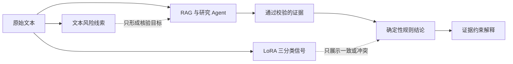

# 三篇论文经验与 RumorBuster 落地矩阵

本项目没有宣称完整复现三篇论文。数据集与既有划分保持冻结，团队使用 LLaMA-Factory 完成 Qwen2.5-3B LoRA 三分类训练，并将模型放入证据优先的系统中，同时吸收可验证、可解释的设计思想。

| 参考材料 | 主要启发 | RumorBuster 已落地 | 没有实现 / 不应宣称 |
|---|---|---|---|
| 多角度谣言解释相关初稿 | 从情绪、夸张、绝对化、矛盾等角度定位文本风险和核验对象 | `ClaimContext.text_risk_analysis`；六类固定维度；原文片段白名单；机构、数字、日期、因果和实体核验目标 | 风险线索本身不证明真假；没有把模型自由生成的解释当作证据 |
| 基于微调大语言模型的域泛化谣言研究（DomFiT） | 区分文本判断、领域适配、审查/质证和传播上下文 | 最多三个子主张；专业领域权威研究分支；evidence-critic 只检查证据缺口；预留评论质证 Schema | 没有完整复现 DomFiT；没有评论爬虫、评论图、传播树或论文中的全部训练过程 |
| 大语言模型 LoRA 微调的可解释谣言检测相关研究 | 使用参数高效微调适配谣言分类任务，关注标签稳定性与可解释边界 | 使用 LLaMA-Factory 完成 Qwen2.5-3B LoRA 训练；1940 条三分类测试准确率 90.00%；严格 `Yes/No/Unknown` 推理；逐子主张审计；与规则结论逐项对照 | 模型未接受本轮网页证据；离线分类准确率不等于系统联网准确率；训练仅监督标签，因此不把模型生成理由宣传为可信解释 |

## 三层可信边界

答辩时应表述为：LoRA 解决参数高效的任务适配，输出的是文本风险三分类；RumorBuster 通过实时检索、来源政策和确定性规则补上事实核验能力。三篇论文提供方法启发，不等同于被完整复现。
