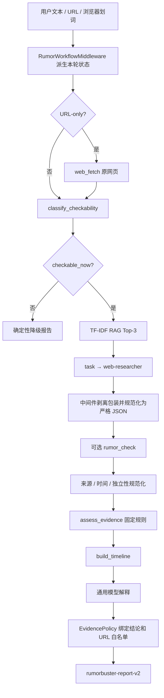

# RumorBuster 工作流 v2：开发留痕与答辩卡

> 本文记录 2026-08-12 的可靠性改造。先作为开发证据保存，功能冻结后再按实验步骤集中学习。

## 1. 为什么改

v1 已有确定性证据规则，但“何时调用 RAG、搜索、分类器和裁决工具”仍由提示词推动。
如果主模型漏调或乱序，规则可能根本拿不到完整输入。v2 保留 DeerFlow 的
`create_agent` 和流式协议，在 Agent 循环中加入 `RumorWorkflowMiddleware`，把流程顺序和关键参数改为代码约束。

## 2. 调用链



一次模型调用前，中间件只保留当前阶段工具；模型调用后，如果它没有调用该工具，
中间件把本次响应改成受控工具调用。这样兼容 DeepSeek thinking 模式不接受 API 级
强制 `tool_choice` 的限制。`wrap_tool_call` 再锁定
URL、主张、子 Agent 类型和裁决输入，所以模型不能通过更换参数绕过流程。
RAG 固定返回 Top-3，运行阈值为 0.05；历史命中依旧是非权威线索。

## 3. 状态与生命周期

`ThreadState.rumor_workflow` 保存本轮派生状态：

```text
input_message_id → stage → claim_context → tool results
→ normalized evidence → decision → timeline → trace
```

- 状态来源是最新一条 HumanMessage 之后的 ToolMessage，不读取上一轮证据；
- 同一 `thread_id` 保留聊天历史，但新 `input_message_id` 会清空旧 `rumor_report`；
- Checkpointer 保存 LangGraph 状态，不等于长期记忆；
- Memory 不能进入证据白名单，也不能改变等级或结论。

## 4. 来源、时间与独立性

- 模型给出的是 `claimed_source_level`；代码输出 `verified_source_level`；
- `data/source_registry.json` 保存官方域名与职权关键词，已复核知识库只补充候选域名；
- A 级要求官方域名且主张命中受控职权范围，模型提交的 `authority_scope=true` 不能自行升级；
- 已配置专业、学术和采编来源为 B；普通网页最高 C，个人或未知来源为 D；
- 当前状态类证据超过 365 天时，模型布尔声明无效；只有本轮另一条近 365 天、直接且达到 A/B 级的同主张证据才能完成更新确认；历史事件允许旧证据与事件日期匹配；
- 同注册域名、同发布主体或标题摘要相似度不低于 0.85 时合并独立来源组；
- 搜索摘要、原网页、RAG 和记忆不能凑裁决门槛。

## 5. 时间线边界

时间线只在规则已经达到有效门槛、并存在至少三个带日期且可追溯的事件时生成。
网页节点还必须带有合法 `fetched_at` 且 `extraction_status=ok`，只有搜索摘要或无法证明正文抓取成功时不进入时间线。
低等级网页可以作为“传播记录”，但会显示 `used_for_decision=false`。第一个节点称为
“本轮最早检索记录”，不宣称找到了绝对源头。

## 6. 最小实验

### 实验 A：阶段门控

1. 运行 `tests/test_rumor_workflow_v2.py`；
2. 观察只有文本时首阶段为 `checkability`；
3. 观察 URL-only 时首阶段为 `fetch_original`；
4. 模拟网页抓取失败，确认进入 `needs_input` 而不是继续搜索；
5. 在同一消息列表追加“你好”，确认上轮工具不进入新一轮 trace。

### 实验 B：来源降级

1. 构造普通网页并声明为 A；
2. 运行 `normalize_evidence_items`；
3. 确认 `claimed_source_level=A`、`verified_source_level=C`；
4. 把证据日期改为 500 天前，主张设为 `current_status`；
5. 确认得到 `stale_current_status`。

### 实验 C：终局保护

让主模型草稿只输出“我觉得是真的”，同时工作流状态中的规则结论为“证据不足”。
`RumorEvidencePolicyMiddleware` 必须生成完整 Markdown，写入
`rumorbuster-report-v2`，并保留规则结论。

## 7. 答辩卡

**问：现在还是大模型自由综合吗？**

答：不是。大模型负责提取主张、调用当前允许的工具和解释结果；中间件控制阶段，
研究 JSON 由代码直接解析，来源等级由代码向下校正，最终结论由固定门槛生成，终局中间件再次绑定 verdict。

**问：这是自己实现 LangGraph 吗？**

答：不是。LangGraph 提供消息循环、状态图、检查点和流式运行；DeerFlow 提供工具、
子 Agent、中间件装配、Sandbox 等基础设施。团队在其上实现了谣言领域状态、阶段门控、
RAG、证据策略、时间线、终局校验和前端报告。

**问：为什么不用显式 StateGraph 重写？**

答：课程版本需要兼容 DeerFlow 现有的 `create_agent`、工具事件、子 Agent 卡片和前端流式协议。
阶段门控中间件能在较小改动下获得可测试的确定性顺序，避免重写整套运行基础。

**问：Sandbox 在这条链上做什么？**

答：当前不参与真假裁决。它仍为线程隔离的文件和命令操作提供基础能力，可用于后续报告归档和评测产物；不能把它描述成事实核验算法。

## 8. 当前验证记录

- RumorBuster 后端定向测试：40 项通过（含脚本化完整阶段链、网页抓取时间和 RAG 参数锁定校验）；
- 离线评测：可核验性、RAG Recall@3、工作流阶段和完整规则均为 1.0；
- 对抗集中的“仅分类器”指标不代表自然分布准确率；
- 前端报告保留 v1 兼容，并新增 v2 工作流状态、等级校正、子主张和传播时间线。
- 真实 LangGraph + DeepSeek 运行留痕见 `evaluation/traces/workflow-v2-real-2026-08-12.json`：RAG 命中但证据门槛不足时，规则仍输出“证据不足”且不生成伪时间线。
