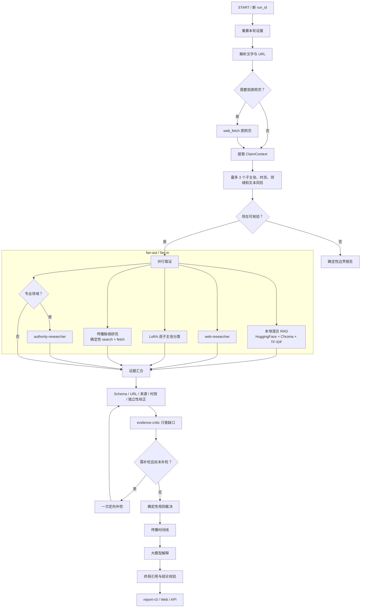

# RumorBuster V3 显式工作流实现与学习留痕

> **2026-08-14 修订说明：** 本文保留 V3 演进历史，其中“传播检索”和“模型自由补检”的描述不再代表默认运行路径。当前传播研究默认关闭，第三次自由补检已取消；真实判定修复、两阶段检索和30条联网门槛以 [REAL_FACTCHECK_ACCEPTANCE.md](REAL_FACTCHECK_ACCEPTANCE.md) 为准。

## 当前实现状态

V3 已注册为默认 `rumor_agent`，V2 串行门控工厂保留为 `rumor_agent_v2`。两者沿用相同的 LangGraph 线程、Gateway API 和前端流式协议，因此可以在不改变外部接口的情况下比较与回退。

## 实际并行与顺序边界

并行分支共有五类能力：本地混合 RAG、普通网页研究、可选分类器、专业领域的权威研究，以及独立的传播脉络研究。传播分支不运行模型 Agent 循环，而是由代码固定执行一次 `web_search`，并发抓取最多五个候选正文，再从网页元数据和正文开头提取发布日期；因此不会受到模型重复 `tool_call_id` 的影响。它使用单独的状态槽，只寻找本轮最早记录、扩散、变体、纠正与再传播页面。RAG 对最多三个实质子主张分别运行 Chroma 语义召回和 TF-IDF 关键词召回，以 RRF 汇合；索引未构建或模型不可用时退回 TF-IDF。`branch_status` 分别记录开始、结束、耗时、结果数和错误码；某一分支异常只产生降级码，不取消已成功分支。

原网页抓取、主张提取、可核验性、证据汇合、证据审查、裁决、时间线、解释和终局校验仍按顺序执行。规则裁决必须位于 fan-in 之后，避免使用尚未汇合的局部证据。

## 三个子 Agent 的权限

| 角色 | 工具与预算 | 允许做什么 | 明确禁止 |
|---|---|---|---|
| `web-researcher` | `web_search ×1`、`web_fetch ×0..3`，55 秒 | 收集普通公开网页并返回严格 JSON | 输出 verdict、提升来源等级 |
| `authority-researcher` | `web_search ×1`、`web_fetch ×0..2`，55 秒 | 专业领域按受控权威域名取证 | 充当专业向量 RAG、使用 Sandbox、裁决真假 |
| `evidence-critic` | 无工具，20 秒 | 检查覆盖、答非所问、冲突和转载；代码同步预判裁决门槛并决定是否补检 | 新增 URL、证据、等级或 verdict |

传播脉络研究不是第四个 Agent 角色，而是确定性工具分支：一次搜索、最多五次并发正文抓取，搜索与抓取阶段合计预算约 30 秒。其结果由代码强制标为 `timeline_only=true` 和 `stance=context`，即使来源权威也不能进入真假裁决门槛。补检则是普通研究能力的一次受限重用：最多一次、35 秒、一次搜索和最多两次抓取。

`knowledge-analyst`、`rag-analyst` 与 `evidence-archiver` 仅保留为 DeerFlow/旧原型参考，不进入 V3 真假裁决路径。当前设计是“多 Agent 分工取证”，不是“多 Agent 讨论投票”。

## 状态和数据可信边界

- 新用户消息创建新 `run_id`，清空本轮证据；历史消息仍在 checkpoint 中，但不能成为本轮证据。
- `SubagentExecutor` 额外返回实际 `ToolMessage`，V3 只信任本轮工具真实观察到的 URL；研究员最终文本里凭空出现的链接会被排除。
- `web_fetch` 的结构化结果由工具写入 UTC `fetched_at`；V3 仅对实际成功抓取且 URL 匹配的证据回填该时间。搜索结果或模型声明的抓取时间不进入可信边界。
- 模型声明的来源等级只能被代码维持或下调，不能自行上调。
- RAG、分类标签、长期记忆和传播记录都不能改变规则 verdict。
- 时间线只接收具有有效发布日期且正文抓取可追溯的页面；同日期同来源会合并，至少三个去重节点才展示。裁决为“证据不足”时仍可展示传播脉络，但必须注明它只描述页面记录，不证明真假；首节点只能称“本轮最早检索记录”，不能称为绝对首发。
- 多角度文本风险只保留能在原文中反查的片段，核验目标和搜索提示不得生成 URL，也不能进入 A/B 证据门槛。
- LoRA 分类分支最多顺序处理三个实质子主张，通过 ModelScope `/v1/chat` 精确读取 `Yes/No/Unknown`；模型 ID、耗时、输入哈希和请求 ID进入脱敏审计，API Key 与地址不进入报告。
- 规则裁决后按子主张计算 `consistent/conflict/uncertain/unavailable/not_comparable`；只有 `rumor/non_rumor` 能映射真假，非法标签不会默认当成“非谣言”。
- `evidence-critic` 的模型输出只能补充说明和建议查询；代码会先用同一规则引擎检查覆盖后的证据是否达到 A / 两条独立 B 门槛。缺主张或门槛不足时才允许一次补检，并可把 RAG 中已复核记录的权威来源作为待抓取候选，而不是直接当作证据。
- 模型解释失败时，终局节点仍使用结构化状态生成完整报告。
- `repair_temporality` 用确定性优先级校正时态：历史/未来/显式当前标记（目前、现在、现行、最新、当前、截至）优先；无时态标记的普遍性事实（如“抽烟有害身体健康”）确定为 `general`，不适用 365 天时效淘汰，模型对无标记主张的 current_status 判定会被代码降级为 general 并记录 `model_current_status_overridden` 依据。

## V2 与 V3 的区别

| 项目 | V2 | V3 |
|---|---|---|
| 主流程 | `create_agent` 模型循环 + 阶段门控中间件 | 显式 `StateGraph` 节点和条件边 |
| 取证方式 | 主要串行 | RAG、普通网页、传播脉络、分类器、权威研究并行 |
| 专业路由 | 提示词提示 | 模型结构化结果 + 关键词规则兜底 |
| 缺口检查 | 主模型自由综合 | 无工具 critic + 代码门槛，最多一次补检 |
| 最终保护 | `RumorEvidencePolicyMiddleware` | `finalize` 节点确定性绑定 URL 与 verdict |
| 使用目的 | 稳定回退、演进对照 | 默认生产图 |

## 实现入口

- V3 图与服务边界：`packages/harness/deerflow/agents/rumor_agent/graph_v3.py`
- V2/V3 工厂：`packages/harness/deerflow/agents/rumor_agent/__init__.py`
- 图注册：`langgraph.json`
- 状态 Schema：`packages/harness/deerflow/agents/rumor_agent/schemas.py`
- 研究执行与工具消息留痕：`packages/harness/deerflow/subagents/executor.py`
- 三个受限角色：`packages/harness/deerflow/subagents/builtins/rumor_*researcher.py`、`rumor_evidence_critic.py`
- Gateway 状态兼容：`app/gateway/routers/checks.py`
- 前端报告：`frontend/src/components/workspace/messages/rumor-report-card.tsx`

## 已完成验证留痕（2026-08-12）

- 2026-08-14 新增确定性传播脉络并行分支、网页发布日期提取、时间线专用证据隔离与不足计数后，RumorBuster 定向后端回归 107 项通过；前端 12 项纯函数测试、ESLint、TypeScript 和生产构建通过。
- 本地生产网页以“喝高度白酒可以杀死体内的新冠病毒”为真实联网案例完成端到端复核：传播分支约 8.1 秒完成，页面显示 2022-01-19、2022-12-26、2023-01-05 三个可点击节点；普通/权威研究分支当次不可用且 verdict 为“证据不足”时，传播时间线仍独立展示并明确不代表绝对首发、不参与真假裁决。实时检索结果会随网络和搜索提供商变化，因此节点数量不是固定演示数据。
- `make_rumor_agent` 与 `make_rumor_agent_v2` 均在真实容器依赖中编译为 `CompiledStateGraph`。
- 前端变更通过 Prettier、ESLint 和 TypeScript `--noEmit`。
- 生产 Next.js 构建成功，Compose 四个服务健康，Nginx 同源网页、Gateway 和 LangGraph 路由可访问。
- 真实网页端在同一 `thread_id` 中先完成普通闲聊，再以新 `run_id` 生成“非事实性表达”的 `rumorbuster-report-v3`；同步 `GET /api/v1/checks/{check_id}` 读到相同结构化报告，全程未触发外部取证。
- 固定 40 条综合离线清单达到组件正确率 1.0；清单组成是 10 条边界、8 条 RAG、12 条证据/专业规则、5 条混合子主张和 5 条 URL/故障路由。
- 新增 `evaluation/demo_cases.json` 和 `scripts/run_demo_cases.py`。每次运行都创建独立线程并保存脱敏 JSON/Markdown，不保存 thread ID、密钥或完整环境变量；单个案例失败不会中止整组。
- 非事实边界的真实 V2/V3 对照中，两图结论均为“非事实性表达”：V2 约 19.9 秒且产生 1 条工具消息，V3 约 1.4 秒且外部调用为 0，证明显式前置分流减少了无效模型循环。
- 三个 V3 固定案例各运行一次并全部通过报告版本、规则绑定、URL 白名单和时间线反查校验，耗时约 1.5 秒、19.2 秒和 32.1 秒；科学 URL 案例成功读取 NASA 原网页并触发专业权威分支。
- 抓取溯源修复后，真实网页证据的 `fetched_at` 已由工具结果按 URL 绑定。医学案例随后暴露“已覆盖但未达门槛”的缺口；修复后的最终运行确实触发一次补检，补检返回非法结果时安全标记 `supplement_research_unavailable`，仍在约 51.7 秒内生成可追溯的“证据不足”报告。
- URL-only 冒烟暴露了 DeepSeek 结构化输出不兼容时把“网页主要内容”误当主张的问题。当前先过滤这类操作指令，再尝试普通模型严格 JSON 回退；两层提取都失败时不再发起失真的搜索，而是要求用户补充明确主张。
- URL-only 修复后的 NASA 实测成功从正文提取“地球正在以前所未有的速度变暖，人类活动是主要原因”，拆出 3 个子主张并进入完整核验，约 61.7 秒完成；模型产生的未来 `event_date` 会被代码清空。来源注册表新增 NASA/IPCC 的气候职权规则，但最终科学案例中权威研究分支实时失败，系统仍按规则输出“证据不足”，没有用 RAG 或普通网页强行改判；该产物可作为搜索波动失败案例。
- 全仓上游套件结果为 1023 通过、13 跳过、15 失败；其中 13 项来自扁平化课程目录与上游测试硬编码 `/scripts`、`/docker`、`/skills`/`backend` 路径不一致，2 项跨平台 XHTML MIME 断言随后已修复并单独通过。

40 条清单复用可重复组件样本，不是 40 次实时联网运行。当前三个固定案例只各运行一次，医学与科学案例依赖实时搜索结果；“三个案例连续运行两次”仍待完成，因此不能写成“全部验收通过”。本轮原始产物位于 `evaluation/demo_runs/20260812-*`。

8 月 17 日修复“抽烟有害身体健康”被判“证据不足”：新增 general 时态（`repair_temporality` 把无时态标记主张的模型 current_status 判定确定性降级，`normalized_temporal_relevance` 对 general/timeless 豁免 365 天规则，含“目前/最新/当前”等标记的主张仍走原规则）；本地抓取加固（浏览器 UA、429/5xx 与连接错误有限重试、最多 5 跳重定向、空正文返回 Error、max_chars 默认 12000、PDF 正文提取）；信息源切换 Tavily（搜索+提取在 Tavily 服务器完成，结构化溯源协议不变）；汇合后确定性补抓（最多 2 条 A/B 级“未抓取或摘引未验证”的直接证据，代码抓取正文并按主张关键词选取逐字引文，失败保持排除，不降门槛）。连续两轮真实运行均判“非谣言（high）”，分别由国家卫健委与 WHO 的 A 级证据支撑。定向回归 127 项通过，40 条清单 full_rule_accuracy 等全部 1.0，无回归。

## 两人学习与交叉讲解

| 时间 | 共同学习 | 成员 A 主讲 | 成员 B 主讲 | 必留产物 |
|---|---|---|---|---|
| 8 月 13 日 | State、节点、条件边、checkpoint | `graph_v3.py` 入口 | v3 类型和阶段条 | 手画状态图、一次 trace |
| 8 月 14 日 | fan-out/fan-in、reducer | 并行分支与降级 | 分支卡片和耗时 | 并行重叠测试截图 |
| 8 月 15 日 | 子 Agent 白名单 | Executor 与严格 JSON | evidence review 展示 | 调用链、越权失败实验 |
| 8 月 16 日 | 规则与引用可信边界 | 证据校正和裁决 | API、导出和兼容 | 冲突案例、URL 排除日志 |
| 8 月 17 日 | 指标与失败分析 | 后端集成测试 | 40 条评测和演示 | 结果表、三张失败卡 |
| 8 月 18—20 日 | 三层归属、部署 | LangGraph/DeerFlow 源码 | Gateway/前端/Nginx | 30 秒、90 秒、2 分钟讲稿 |
| 8 月 21—23 日 | 交叉模拟答辩 | 能回答前端/API | 能回答主图/规则 | 两轮录音和问题清单 |

每个模块仍按“用途、接口、调用链、生命周期、项目用法、失败与改造”六格卡片学习，并至少完成一个最小实验、一次日志跟踪和一次脱稿讲解。
